# PNTC Architecture Specification & Dataflow

**Document**: `docs/PNTC_METHOD_ARCHITECTURE.md`  
**Framework**: Paired Neighborhood Topology Consistency (PNTC)

---

## 1. System Architecture Diagram

```mermaid
flowchart TD
    subgraph Offline_Memory_Construction ["TRAIN-NORMAL MEMORY CONSTRUCTION (Offline)"]
        T_RGB["Train RGB Images"] --> F_RGB["Frozen DINOv2 (ViT-B/14)"] --> R_Train["RGB Features {r_j}"]
        T_XYZ["Train Point Clouds"] --> F_XYZ["Frozen Point-MAE"] --> X_Train["3D Features {x_j}"]
        R_Train & X_Train --> J_Select["Joint Selector q_j = [alpha*r_j || alpha*x_j]"]
        J_Select --> Coreset["Paired MinMax Coreset (M = 15,000)"]
        Coreset --> M_RGB["RGB Memory Bank M_rgb {r_j}"]
        Coreset --> M_XYZ["3D Memory Bank M_xyz {x_j}"]
    end

    subgraph Online_Inference ["TEST INFERENCE PIPELINE (Online)"]
        In_RGB["Test RGB Patch r_p"] --> Ret_RGB["Query M_rgb (top-k=5)"]
        In_XYZ["Test 3D Patch x_p"] --> Ret_XYZ["Query M_xyz (top-k=5)"]
        
        Ret_RGB --> N_RGB["Top-k IDs & Distances N_rgb(p)"]
        Ret_XYZ --> N_XYZ["Top-k IDs & Distances N_xyz(p)"]
        
        N_RGB & N_XYZ --> Base_Score["Calibrated Decision Fusion A_base(p)"]
        N_RGB & N_XYZ --> JS_Topo["Soft Prototype JS Divergence T(p)"]
        N_RGB & N_XYZ --> Conf_Gate["Normal Retrieval Confidence Gate G(p)"]
        
        Base_Score --> Combiner["A_PNTC(p) = A_base(p) + lambda * G(p) * T(p)"]
        JS_Topo --> Combiner
        Conf_Gate --> Combiner
        
        Combiner --> Anom_Map["Pixel Anomaly Map (224 x 224)"]
        Anom_Map --> Img_Score["Image Score: mean_top_0.5%(A_PNTC)"]
    end
```

---

## 2. Detailed Pipeline Specifications

### Stage 1: Frozen Feature Representations
- **RGB Modality**: Pre-trained DINOv2 ViT-B/14 (`vit_base_patch14_dinov2.lvd142m`). Patch size $14 \times 14$, token grid $16 \times 16$, output dimension $D_{\text{rgb}} = 768$. Bilinear feature alignment to common $56 \times 56$ grid.
- **3D Modality**: Pre-trained Point-MAE encoder on 2048 point coordinates. Output token dimension $D_{\text{xyz}} = 1152$, spatially mapped to common $56 \times 56$ grid.

### Stage 2: Joint Paired Coreset (Nominal Training Only)
- For every physical patch $j$, construct normalized descriptor $q_j = \left[ \frac{1}{\sqrt{2}} \frac{r_j}{\|r_j\|} \,\|\, \frac{1}{\sqrt{2}} \frac{x_j}{\|x_j\|} \right]$.
- Greedy MinMax coreset selects representative prototype subset $\mathcal{C} \subset \{1, \dots, N_{\text{train}}\}$ with $|\mathcal{C}| = M = 15{,}000$.
- Store paired banks sharing exact prototype index $j$: $\mathcal{M}_{\text{rgb}} = \{r_j\}_{j \in \mathcal{C}}$ and $\mathcal{M}_{\text{xyz}} = \{x_j\}_{j \in \mathcal{C}}$.

### Stage 3: Independent Modality Retrieval
- For test patch $p$, retrieve top-$k$ ($k=5$) nearest neighbors in $\mathcal{M}_{\text{rgb}}$ $\to \mathcal{N}_{\text{rgb}}(p) = \{(j_{\text{rgb}, m}, d_{\text{rgb}, m})\}_{m=1}^5$.
- Retrieve top-$k$ ($k=5$) nearest neighbors in $\mathcal{M}_{\text{xyz}}$ $\to \mathcal{N}_{\text{xyz}}(p) = \{(j_{\text{xyz}, m}, d_{\text{xyz}, m})\}_{m=1}^5$.

### Stage 4: Topology Inconsistency & Confidence Gating
- Soft distributions $P_{\text{rgb}}, P_{\text{xyz}}$ over $\mathcal{U}(p) = \mathcal{I}_{\text{rgb}}(p) \cup \mathcal{I}_{\text{xyz}}(p)$ with train-derived temperatures $\tau_{\text{rgb}}, \tau_{\text{xyz}}$.
- Normalized Jensen-Shannon Divergence: $T(p) = \frac{\text{JSD}(P_{\text{rgb}} \,\|\, P_{\text{xyz}})}{\ln 2} \in [0, 1]$.
- Normal Retrieval Confidence Gate: $G(p) = \text{clip}\left( \sigma(\max(z_{\text{rgb}}, z_{\text{xyz}})) \cdot C(p), \, 0.0, \, 1.0 \right)$.

### Stage 5: Final Scoring & Evaluator Input
- Pixel Anomaly Map: $A_{\text{pntc}}(p) = A_{\text{base}}(p) + \lambda \cdot G(p) \cdot T(p)$ ($\lambda = 0.35$).
- Spatial smoothing with Gaussian filter $\sigma = 3.8$, upsampled to $224 \times 224$.
- Image Score: $S_{\text{image}} = \text{mean\_top\_0.5\%}(A_{\text{pntc}})$.
